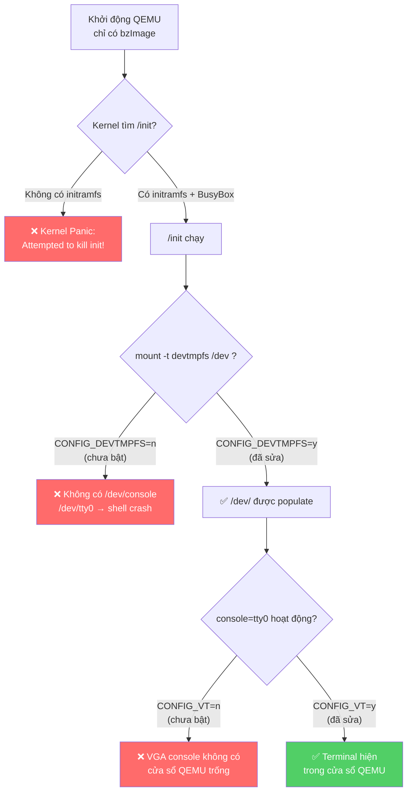
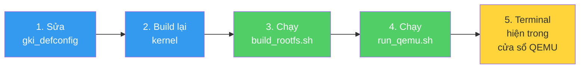

# Tổng Hợp: Chạy Android Kernel Trên QEMU


## 1. Tại sao cần BusyBox. Để boot lên được thì android ngoài kernel còn cần những gì? Cơ chế hoạt động của nó ra sao
### 1.1 Cơ chế khởi động của Linux Kernel

Khi QEMU khởi động với một `bzImage` (kernel), quá trình boot diễn ra như sau:

```
BIOS/SeaBIOS → Giải nén kernel → Khởi tạo phần cứng → Tìm init process → Chạy shell
```

Ở bước cuối cùng, kernel **bắt buộc** phải tìm được một chương trình gọi là **init process** (`/init`, `/sbin/init`, hoặc `/bin/sh`). Nếu không tìm thấy → **Kernel Panic**:

```
Kernel panic - not syncing: Attempted to kill init! exitcode=0x00000000
```

### 1.2 Vấn đề: Kernel Android chỉ là "bộ não" — không có "cơ thể"

| Thành phần | Có sẵn? | Giải thích |
|---|---|---|
| `bzImage` (kernel) | ✅ | Phần lõi xử lý phần cứng, quản lý bộ nhớ, lập lịch tiến trình |
| Root filesystem (rootfs) | ❌ | Chứa các chương trình userspace (`sh`, `ls`, `mount`, `cat`...) |
| Init process (`/init`) | ❌ | Chương trình đầu tiên kernel chạy sau khi boot |
| Thiết bị `/dev/*` | ❌ | Các device node (`/dev/console`, `/dev/tty0`) để giao tiếp |

**Kernel giống như bộ não** — nó quản lý mọi thứ nhưng bản thân nó không thể hiển thị terminal hay chạy lệnh. Cần có **userspace** (rootfs) để tương tác.

### 1.3 Tại sao chọn BusyBox?

**BusyBox** là một chương trình duy nhất (~2MB) tích hợp hàng trăm lệnh Linux cơ bản:

```
busybox = sh + ls + cat + mount + mkdir + insmod + dmesg + mdev + ...
```

| Giải pháp thay thế | Kích thước | Phù hợp? |
|---|---|---|
| Ubuntu/Debian rootfs | ~200MB+ | ❌ Quá nặng cho thử nghiệm kernel |
| Alpine Linux rootfs | ~5MB | ⚠️ Có thể dùng, nhưng phức tạp hơn |
| **BusyBox (static)** | **~2MB** | **✅ Nhẹ, đủ dùng, dễ tạo initramfs** |

Khi cài `busybox-static`, ta có file `/usr/bin/busybox` đã biên dịch tĩnh (static) — không phụ thuộc thư viện nào, chạy được trên bất kỳ kernel Linux nào.

### 1.4 Initramfs là gì?

**Initramfs** (Initial RAM Filesystem) là một hệ thống tập tin nhỏ được **nén và nhúng cùng kernel**. Khi kernel boot:

```
1. Kernel giải nén initramfs vào RAM
2. Mount nó làm root filesystem (/)  
3. Tìm và chạy /init
4. /init thiết lập môi trường (mount /proc, /dev, ...) rồi chạy shell
```

Cấu trúc initramfs tối thiểu:
```
initramfs/
├── bin/busybox          ← Chương trình duy nhất cần thiết
├── init                 ← Script khởi tạo (kernel chạy file này đầu tiên)
├── dev/                 ← Device nodes (tạo bởi devtmpfs hoặc mknod)
├── proc/                ← Mount point cho procfs
├── sys/                 ← Mount point cho sysfs
├── modules/             ← Kernel modules (.ko) để nạp
│   └── hello_module.ko
└── tmp/
```

### 1.5 Chuỗi lỗi đã gặp và nguyên nhân gốc



---

## 2. Các bước khắc phục và giải thích build_rootfs.sh

### 2.1 Tổng quan các bước khắc phục

| Bước | Hành động | Mục đích |
|---|---|---|
| 1 | Cài `busybox-static` | Có chương trình userspace |
| 2 | Tạo cấu trúc thư mục initramfs | Chuẩn bị root filesystem |
| 3 | Viết script `/init` | Chương trình khởi tạo đầu tiên |
| 4 | Copy kernel modules vào initramfs | Để nạp/thử nghiệm trong VM |
| 5 | Đóng gói thành `initramfs.cpio.gz` | Định dạng kernel hiểu được |
| 6 | Sửa kernel config (xem phần 3) | Bật các tính năng console cần thiết |
| 7 | Build lại kernel | Áp dụng config mới |
| 8 | Chạy QEMU với cả bzImage + initramfs | Khởi động VM hoàn chỉnh |

### 2.2 Giải thích chi tiết file [build_rootfs.sh](file:///home/trungcao/training/android-kernel/out/build_rootfs.sh)

#### Bước 1: Tạo cấu trúc thư mục

```bash
mkdir -p "$OUTDIR/initramfs"/{bin,sbin,etc,proc,sys,dev,tmp,lib,mnt/host,usr/bin,usr/sbin,modules}
```

| Thư mục | Vai trò |
|---|---|
| `bin/` | Chứa BusyBox (và symlinks: `sh`, `ls`, `cat`...) |
| `proc/` | Mount point cho **procfs** — thông tin tiến trình, CPU, bộ nhớ |
| `sys/` | Mount point cho **sysfs** — thông tin thiết bị phần cứng |
| `dev/` | Mount point cho **devtmpfs** — device nodes (`console`, `tty0`...) |
| `modules/` | Chứa các file `.ko` (kernel modules) để nạp trong VM |
| `tmp/` | Thư mục tạm |

#### Bước 2: Sao chép BusyBox

```bash
cp /usr/bin/busybox "$OUTDIR/initramfs/bin/"
```

BusyBox static (~2MB) chứa hàng trăm lệnh. Sau khi chạy `--install -s`, nó tạo symlinks:

```
/bin/sh → /bin/busybox
/bin/ls → /bin/busybox
/bin/mount → /bin/busybox
/bin/insmod → /bin/busybox
... (200+ lệnh khác)
```

#### Bước 3: Script `/init` — trái tim của initramfs

Script này là **chương trình đầu tiên** kernel chạy. Từng dòng được giải thích:

```bash
#!/bin/busybox sh                    # Dùng BusyBox shell (không phải bash)

/bin/busybox --install -s /bin       # Tạo symlinks cho tất cả lệnh BusyBox

mount -t proc     none /proc        # Mount procfs → truy cập /proc/cpuinfo, /proc/modules...
mount -t sysfs    none /sys         # Mount sysfs → truy cập thông tin phần cứng
mount -t devtmpfs none /dev         # Mount devtmpfs → kernel tự tạo /dev/console, /dev/tty0...

echo /bin/mdev > /proc/sys/kernel/hotplug  # Đăng ký mdev làm hotplug handler
mdev -s                                    # Quét và tạo device nodes cho thiết bị hiện có

# Nạp tất cả kernel modules trong /modules/
for mod in /modules/*.ko; do
    [ -f "$mod" ] && insmod "$mod" 2>/dev/null
done

# Chuyển stdin/stdout/stderr sang console chính
# /dev/console được kernel map tới console cuối cùng trong kernel args
# Ví dụ: console=tty0 → /dev/console = VGA display
exec 0</dev/console
exec 1>/dev/console  
exec 2>/dev/console

exec /bin/sh -i                      # Chạy shell tương tác (thay thế init process)
```

> [!IMPORTANT]
> `exec /bin/sh -i` thay thế process init bằng shell. Nếu shell thoát → kernel panic
> (vì PID 1 không được phép chết). Vì vậy dùng `exec` chứ không phải chạy `sh` bình thường.

#### Bước 4: Sao chép kernel modules

```bash
# Module bạn tự viết
cp "$KERNEL_ROOT/bazel-bin/mymodule/hello_module/hello_module.ko" "$OUTDIR/initramfs/modules/"

# Các module .ko khác trong thư mục out/ (virtio_pci.ko, ...)
for ko in "$OUTDIR"/*.ko; do
    [ -f "$ko" ] && cp "$ko" "$OUTDIR/initramfs/modules/"
done
```

#### Bước 5: Đóng gói initramfs

```bash
find . -print0 | cpio --null -ov --format=newc | gzip -9 > ../initramfs.cpio.gz
```

| Lệnh | Vai trò |
|---|---|
| `find . -print0` | Liệt kê tất cả file (hỗ trợ tên file có khoảng trắng) |
| `cpio --format=newc` | Đóng gói thành định dạng **newc** (kernel yêu cầu) |
| `gzip -9` | Nén tối đa để giảm kích thước |

Kết quả: `initramfs.cpio.gz` (~2MB) — truyền cho QEMU qua tham số `-initrd`.

### 2.3 Giải thích file [run_qemu.sh](file:///home/trungcao/training/android-kernel/out/run_qemu.sh)

```bash
qemu-system-x86_64 \
    -kernel "$BZIMAGE" \             # Kernel image để boot
    -initrd "$INITRAMFS" \           # Initramfs chứa BusyBox + modules
    -display gtk \                   # Mở cửa sổ đồ họa GTK
    -vga std \                       # Thiết bị VGA chuẩn
    -append "console=ttyS0 console=tty0 loglevel=4" \  # Kernel args
    -m 1024 \                        # 1GB RAM
    -enable-kvm \                    # Tăng tốc phần cứng (KVM)
    -cpu host \                      # Dùng CPU thật của máy host
    -smp 2                           # 2 CPU cores
```

> [!NOTE]
> **Thứ tự `console=` rất quan trọng!** Linux dùng cái **cuối cùng** làm `/dev/console`.
> - `console=ttyS0 console=tty0` → `/dev/console` = `tty0` (VGA window) ✅
> - `console=tty0 console=ttyS0` → `/dev/console` = `ttyS0` (serial port, không hiện trên VGA) ❌

---

## 3. Thay đổi cấu hình kernel và module

### 3.1 Tổng quan thay đổi

File cấu hình: [gki_defconfig](file:///home/trungcao/training/android-kernel/common/arch/x86/configs/gki_defconfig)

Tất cả thay đổi được thực hiện trong file `common/arch/x86/configs/gki_defconfig`:

```diff
  CONFIG_PCI_ENDPOINT=y
+ CONFIG_DEVTMPFS=y
+ CONFIG_DEVTMPFS_MOUNT=y
  CONFIG_FW_LOADER_USER_HELPER=y

  ...

  CONFIG_INPUT_UINPUT=y
- # CONFIG_VT is not set
  # CONFIG_LEGACY_PTYS is not set
  CONFIG_SERIAL_8250=y

  ...

  CONFIG_SERIAL_8250_NR_UARTS=32
- CONFIG_SERIAL_8250_RUNTIME_UARTS=0
  CONFIG_SERIAL_OF_PLATFORM=y
```

### 3.2 Chi tiết từng thay đổi

#### 3.2.1 `CONFIG_DEVTMPFS=y` (THÊM MỚI)

| Thuộc tính | Giá trị |
|---|---|
| **Trước** | `# CONFIG_DEVTMPFS is not set` (không có) |
| **Sau** | `CONFIG_DEVTMPFS=y` |
| **Loại** | Filesystem driver (built-in) |

**Giải thích**: `devtmpfs` là một filesystem ảo mà **kernel tự động tạo device nodes** trong `/dev/` cho mọi thiết bị phần cứng được phát hiện. Không có nó:

```
# Không có devtmpfs:
/dev/           ← Thư mục rỗng, không có gì!
                   Không thể truy cập console, serial, disk...

# Có devtmpfs:
/dev/
├── console     ← Console chính (kernel tự tạo)
├── tty0        ← VGA terminal
├── ttyS0       ← Serial port
├── null        ← /dev/null
├── zero        ← /dev/zero
├── random      ← Random number generator
└── ...         ← Hàng trăm device khác
```

**Tại sao Android kernel mặc định tắt?** Vì thiết bị Android thật dùng hệ thống init riêng (Android Init) tự quản lý `/dev/` thông qua `ueventd`, không cần `devtmpfs`.

#### 3.2.2 `CONFIG_DEVTMPFS_MOUNT=y` (THÊM MỚI)

| Thuộc tính | Giá trị |
|---|---|
| **Trước** | Không có |
| **Sau** | `CONFIG_DEVTMPFS_MOUNT=y` |
| **Loại** | Tùy chọn tự động mount |

**Giải thích**: Khi bật, kernel **tự động mount devtmpfs vào `/dev/`** trước khi chạy `/init`. Điều này đảm bảo `/dev/console` tồn tại ngay từ đầu, không cần script `/init` tự mount.

```
Không có DEVTMPFS_MOUNT:
  Kernel boot → chạy /init → /init phải tự mount devtmpfs → rồi mới có /dev/console

Có DEVTMPFS_MOUNT:  
  Kernel boot → kernel tự mount devtmpfs → /dev/console đã sẵn sàng → chạy /init ✅
```

#### 3.2.3 Xóa `# CONFIG_VT is not set` (BẬT VGA CONSOLE)

| Thuộc tính | Giá trị |
|---|---|
| **Trước** | `# CONFIG_VT is not set` (tắt VGA console) |
| **Sau** | Xóa dòng này (mặc định = `y`, bật VGA console) |
| **Loại** | Console driver (built-in) |

**Giải thích**: `CONFIG_VT` (Virtual Terminal) cho phép kernel tạo **virtual terminal** trên VGA display. Khi bật:

- `CONFIG_VT=y` → Bật hệ thống Virtual Terminal
- `CONFIG_VT_CONSOLE=y` (tự động bật theo) → Cho phép VT làm console

Đây là thứ cho phép bạn thấy **terminal trong cửa sổ QEMU GTK** (qua `/dev/tty0`).

```
CONFIG_VT=n (mặc định Android):
  Cửa sổ QEMU chỉ hiện BIOS boot → rồi đen thui
  printk: console [ttynull0] enabled    ← Kernel dùng console rỗng!

CONFIG_VT=y (đã sửa):
  Cửa sổ QEMU hiện kernel log + shell terminal
  printk: console [tty0] enabled        ← VGA console hoạt động! ✅
```

**Tại sao Android kernel mặc định tắt?** Thiết bị Android không có màn hình VGA. Giao diện đồ họa Android dùng **framebuffer/DRM** trực tiếp, không qua VT subsystem.

#### 3.2.4 Xóa `CONFIG_SERIAL_8250_RUNTIME_UARTS=0` (BẬT SERIAL PORT)

| Thuộc tính | Giá trị |
|---|---|
| **Trước** | `CONFIG_SERIAL_8250_RUNTIME_UARTS=0` (tắt tất cả serial port) |
| **Sau** | Xóa dòng này (mặc định = `4`, bật 4 serial ports) |
| **Loại** | Serial driver config |

**Giải thích**: `RUNTIME_UARTS` xác định **số lượng serial port** kernel kích hoạt lúc chạy. Khi = 0 → không có serial port nào → `ttyS0` không tồn tại.

```
RUNTIME_UARTS=0:
  /dev/ttyS0 → KHÔNG TỒN TẠI
  console=ttyS0 → Kernel bỏ qua, serial console trống

RUNTIME_UARTS=4 (mặc định khi xóa dòng này):
  /dev/ttyS0 → ✅ Serial port 1 (COM1) 
  /dev/ttyS1 → ✅ Serial port 2 (COM2)
  /dev/ttyS2 → ✅ Serial port 3
  /dev/ttyS3 → ✅ Serial port 4
  console=ttyS0 → Hoạt động! ✅
```

### 3.3 Bảng tổng hợp tất cả thay đổi

| Config | Trước (gốc) | Sau (đã sửa) | Tác dụng |
|---|---|---|---|
| `CONFIG_DEVTMPFS` | ❌ Không có | ✅ `=y` | Kernel tự tạo device nodes trong `/dev/` |
| `CONFIG_DEVTMPFS_MOUNT` | ❌ Không có | ✅ `=y` | Tự động mount `/dev/` trước khi chạy init |
| `CONFIG_VT` | ❌ `not set` | ✅ `=y` (mặc định) | Bật VGA/Virtual Terminal console |
| `CONFIG_VT_CONSOLE` | ❌ Không có | ✅ `=y` (tự động) | Cho phép dùng VT làm console |
| `CONFIG_SERIAL_8250_RUNTIME_UARTS` | ❌ `=0` | ✅ `=4` (mặc định) | Bật 4 serial ports (ttyS0-ttyS3) |

### 3.4 Các config ĐÃ CÓ SẴN trong kernel (không cần sửa)

| Config | Giá trị | Vai trò |
|---|---|---|
| `CONFIG_SERIAL_8250=y` | ✅ Built-in | Driver serial 8250/16550 UART |
| `CONFIG_SERIAL_8250_CONSOLE=y` | ✅ Built-in | Cho phép dùng serial làm console |
| `CONFIG_TTY=y` | ✅ Built-in | Hệ thống TTY (terminal) |
| `CONFIG_UNIX98_PTYS=y` | ✅ Built-in | Pseudo-terminal (pts) |
| `CONFIG_VIRTIO_CONSOLE=m` | ✅ Module | Driver cho virtio console (hvc0) |
| `CONFIG_NET_9P=m` | ✅ Module | Giao thức 9P để chia sẻ file |

### 3.5 Config CHƯA BẬT (hạn chế hiện tại)

| Config | Trạng thái | Ảnh hưởng |
|---|---|---|
| `CONFIG_NET_9P_VIRTIO` | ❌ `not set` | Không thể chia sẻ thư mục host↔guest qua virtio-9p |
| `CONFIG_FRAMEBUFFER_CONSOLE` | ❌ Không có | Chỉ dùng VGA text mode, không có framebuffer |

> [!TIP]
> Nếu muốn chia sẻ file giữa máy thật và VM trong tương lai, bạn cần bật `CONFIG_NET_9P_VIRTIO=y` 
> trong `gki_defconfig` và build lại kernel.

---

## Tổng kết

### Quy trình hoàn chỉnh từ A đến Z



### Lệnh thực thi

```bash
# Bước 1: Build kernel (chỉ cần làm 1 lần sau khi sửa config)
cd ~/training/android-kernel
tools/bazel run //common-modules/virtual-device:virtual_device_x86_64_dist -- --destdir=out

# Bước 2: Tạo rootfs + Chạy QEMU
cd out
./build_rootfs.sh && ./run_qemu.sh
```

### Trong cửa sổ QEMU, thử:

```bash
# Nạp module bạn tự viết
insmod /modules/hello_module.ko

# Xem log kernel (sẽ thấy message từ module)
dmesg | tail

# Liệt kê modules đã nạp
lsmod

# Gỡ module
rmmod hello_module
```
